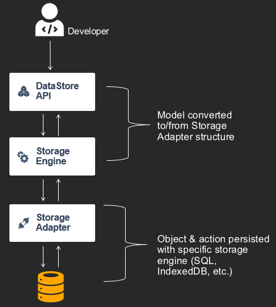
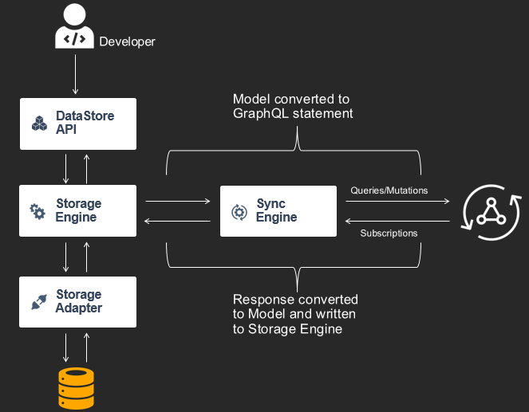
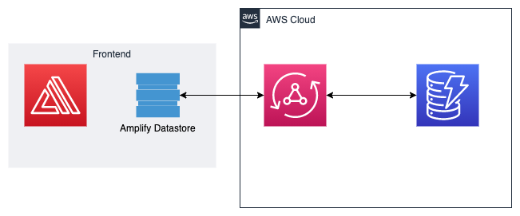

# Develop offline app with amplify datastore and serverless in China region

## Background

Due to the incompleteness of amplify service in China, amplify cli is not capable to deploy the backend on AWS CN region, which makes things quite tricky in China. Since in global region developers can easily build up backend according to frontend need with the help from `amplify push` command, developers in China region would like to do the same on AWS CN. However, due to the missing features such as *cognito userpool*, developers in China find it hard to harness the amplify cli to build integrated frontend with amplify. In order to get around this, I am using *serverless framework* to replace the `amplify push` command. In this sample, I also utilized the built-in database, *amplify datastore*, to build the Todo list website so that the to-do list can be viewed and updated even when it is offline and then it will automatically get synced when it is online.

## Architecture

Amplify datastore architecture

### Target architecture

